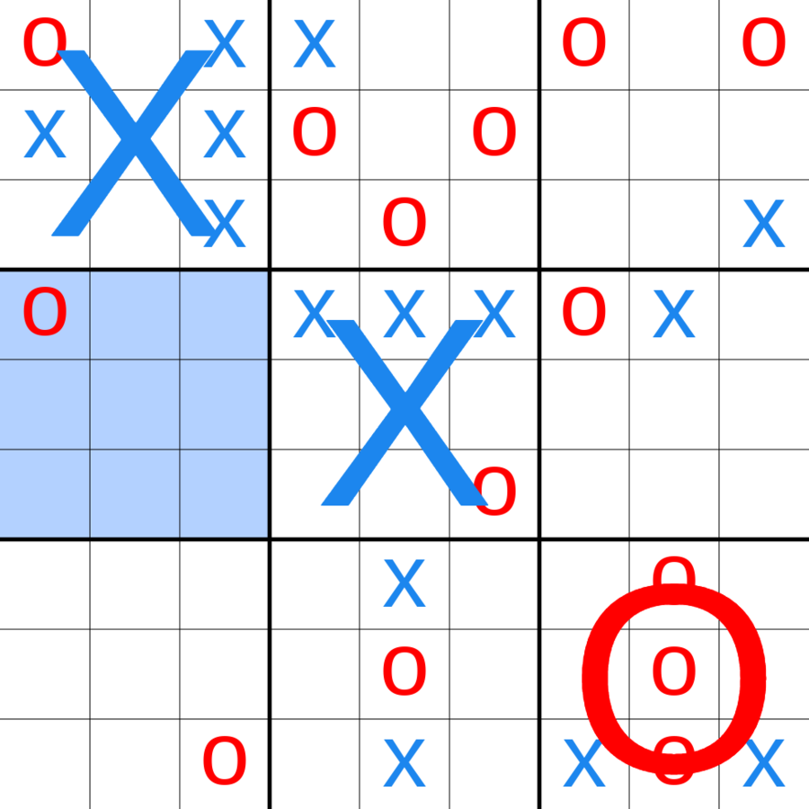
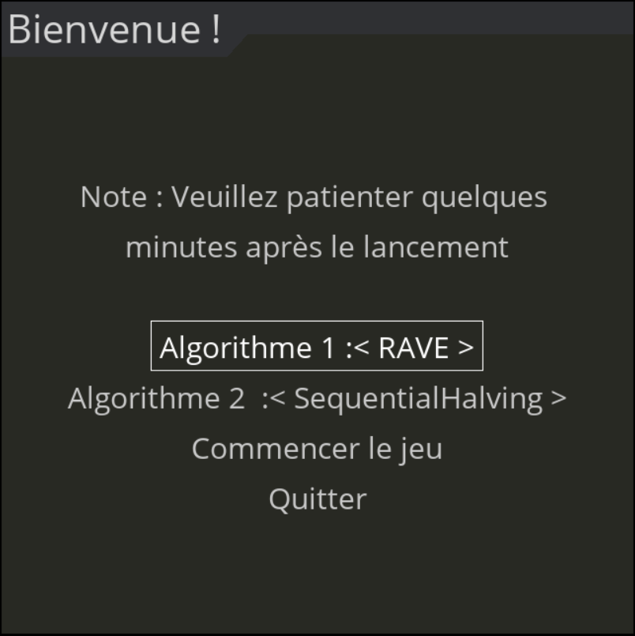
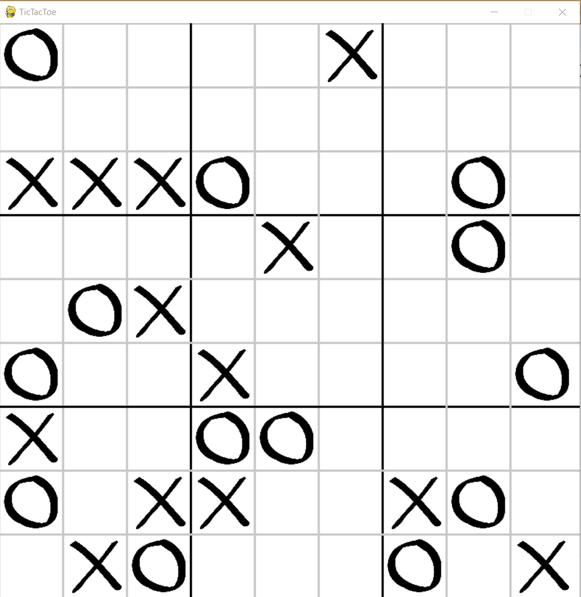

# ultimate-tic-tac-toe-solver

We have chosen to apply MONTE-CARLO Tree search methods on the TIC-TAC-TOE game in its ultimate version. It consists of a board game consisting of nine tic-tac-toe boards arranged in 3 × 3 grid. Players take turns in the smaller tic-tac-toe boards until one of them wins in the biggest tic-tac-toe table.

  

### Rules:
The game begins with X playing wherever he sees fit in one of the 81 slots empty. This movement "sends" their opponent to his relative position. For example, if X has played in the upper right square of his local board, then O must then play on the
local board at the top right of the global board. O can then play in one of the nine places available from this local board, each movement sending X to a board different local.
If a move is made to win a local board under normal tic-tac-toe rules, then the entire local board is marked as a victory for the board player global. We note that both players can win the same local board.
Once a local board is completely full, no more movement can be played on this board. If a player is sent to such a board, then that player can play on any other board.

## Graphical interface:
We have developed a graphical interface using the PyGame library. User can choose which algorithm player 1 ("x") uses and which algorithm player uses 2 ("o"). The algorithms used for: random, Flat, UCB, UCT, RAVE, GRAVE, SequentialHalving and SHUSS.

  
  

